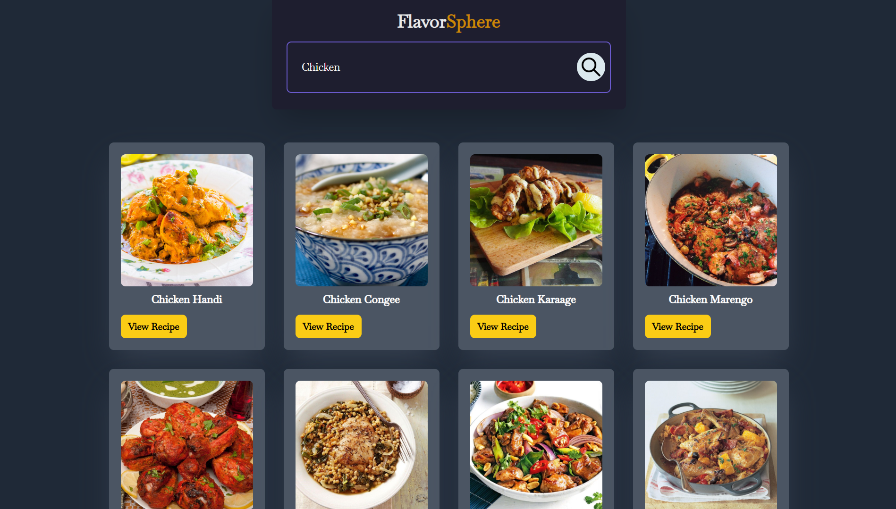
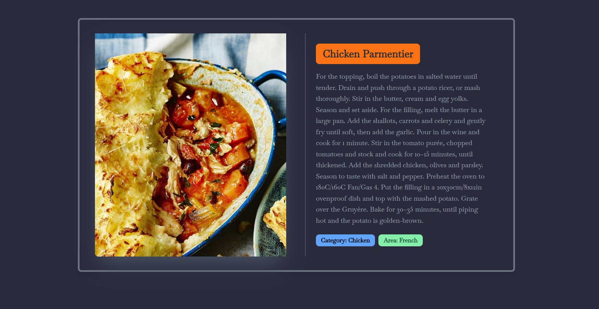

# FlavourSphere 🌮  

A beautifully designed and responsive website built with **React** and **Tailwind CSS**. This project offers insights into various recipes, highlighting diverse cuisines, vibrant dishes, and culinary culture from around the globe.  

**Live Demo:** [FlavourSphere](https://flavoursphere-demo.com) 🌐

## Preview 🖼️  

### Homepage Preview  
  
*Preview of the FlavourSphere homepage built with React and styled with Tailwind CSS.*  

### Dishes Page Preview  
  
*Explore a collection of dishes and their recipes on the Dishes page.*  

### RecipeInfo Page Preview  
  
*Discover detailed instructions, ingredients, and tips for your favorite recipes.*  

## Features ✨  
- **React Components:** Modular and reusable components for maintainability. 🔄  
- **Tailwind CSS Styling:** Quick and efficient styling with a utility-first approach. 🎨  
- **Responsive Design:** Fully optimized for desktop, tablet, and mobile devices. 📱💻  
- **Dynamic Content:** Showcasing recipes, cuisines, and cooking tips with modern UI/UX principles. 🌍🍴  

## Tech Stack 🛠️  
- **React.js:** For building a dynamic and interactive user interface. ⚛️  
- **Tailwind CSS:** For fast, customizable, and responsive styling. 🧵  
- **Vite.js:** For lightning-fast development and optimized builds. ⚡  

## How to Run the Project 🚀  
1. Clone the repository:  
   ```bash  
   git clone https://github.com/SyedShahulAhmed/FlavourSphere.git  
   ```  
2. Navigate to the project folder:  
   ```bash  
   cd FlavourSphere  
   ```  
3. Install dependencies:  
   ```bash  
   npm install  
   ```  
4. Start the development server:  
   ```bash  
   npm run dev  
   ```  
5. Open your browser and navigate to `http://localhost:5173` to view the website. 🌐  

## Contributing 🛠️  
Contributions are welcome! Follow these steps to contribute:  
1. Fork the repository. 🍴  
2. Create a new branch (`git checkout -b feature-name`). 🌱  
3. Commit your changes (`git commit -m 'Add feature'`). 💬  
4. Push to the branch (`git push origin feature-name`). ⬆️  
5. Open a pull request. 🔄  

